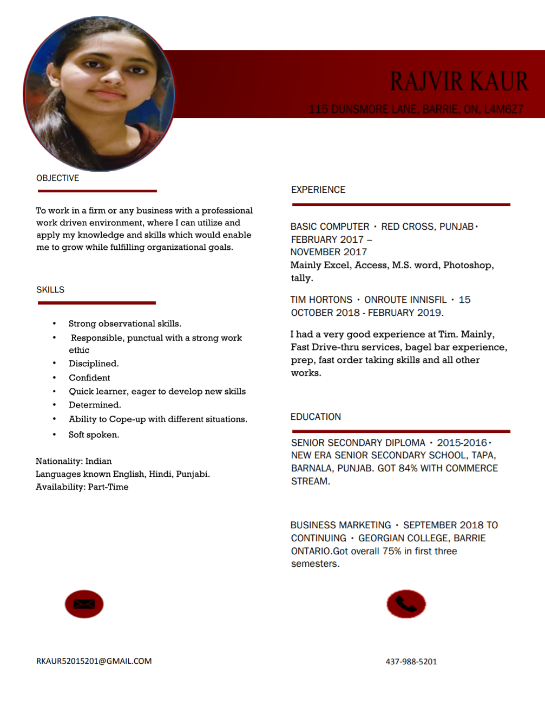

[row]
[col]

 
   

<a class="gradient-button gradient-button-1"
 style="margin-left: 25%;width: 50%;padding: 10px;" href="https://drive.google.com/file/d/1exYK7IH4_0R90uAh8aZ89O_cvJ9jOkYq/view" target="_blank">Download Resume</a> 

[/col]
[/row]
